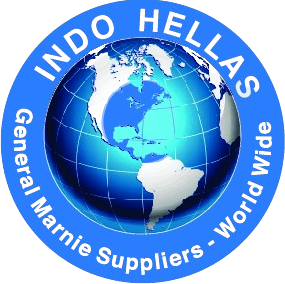

# Indo Hellas — General Marine Suppliers
### Official Website · Designed & Developed with Precision by 
### [The Presence](https://the-presence.netlify.app/)
<div>
    
</div>

---
<div><br></div>
<div align="center">



**A Legacy of Trust. A Commitment to Excellence. A Global Marine Partner You Can Rely On.**

`Ship Chandling` · `Marine Supply` · `ISO Certified` · `Est. 1996` · `Chennai, India`

</div>

---

## About This Project

This is the official website for **Indo Hellas General Marine Suppliers**, a globally recognised ship chandler and marine solutions provider headquartered in Chennai, India. Founded in 1996, Indo Hellas has grown from a local ship supply company into a world-class marine partner trusted by shipowners, fleet managers, and maritime professionals across 7 continents.

This website was conceived, designed, and developed entirely by **The Presence** — a premium web design and development studio specialising in high-end, luxury-themed digital experiences.

---

## About The Client — Indo Hellas

| Detail | Info |
|---|---|
| **Company** | Indo Hellas General Marine Suppliers |
| **Founded** | 1996 |
| **Headquarters** | No. 95, Linghi Chetty Street, 1st Floor, Suite No. 7, Mannady, Chennai – 600 001, India |
| **Phone** | +91 444 216 7484 · +91 444 216 7485 |
| **Email** | technical@indohellas.in · info@indohellas.in |
| **Websites** | [indohellasindia.com](https://www.indohellasindia.com) · [indohellas.in](https://www.indohellas.in) |
| **Certifications** | ISO 9001 · ISO 22000 · ISO 14001 · ISO 45001 · HACCP · IMPA · ShipServe · Procureship |
| **Coverage** | Africa · Asia · Europe · North America · South America · Central America · Caribbean Islands |

---

## About The Builder — The Presence

> *"We build what should be felt."*

**The Presence** is a premium web design and development studio that crafts high-end, cinematic digital experiences for brands that demand excellence. Every pixel, interaction, and line of code is intentional.

| | |
|---|---|
| **Studio** | The Presence |
| **Specialisation** | Luxury & High-End Web Design · B2B Digital Presence · Cinematic UI/UX |
| **Email** | thepresencestudio@gmail.com |
| **Websites** | [www.the-presence.netlify.app](https://the-presence.netlify.app/)
| **Builder** | Ryan Tusi |
| **LinkedIn** | [linkedin.com/in/ryantusi](https://www.linkedin.com/in/ryantusi/) |

---

## Project Highlights

- **Cinematic Hero** — Fullscreen video background with parallax scroll and GSAP-powered entrance animations
- **Custom Preloader** — Branded loading experience with smooth progress counter
- **Interactive Services Carousel** — 10 service categories with auto-rotating image carousel and dynamic content panels
- **Tabbed About Section** — Three-panel about section (Legacy · Journey · Commitment) with timeline milestones and animated counters
- **Bento Grid — Why Us** — Modern two-row bento layout with hover interactions
- **Global Network Section** — Accordion continent/country list with an interactive world map and animated location dots
- **Certificates Section** — Auto-scrolling marquee with clickable certificate modals
- **Contact Section** — Integrated Google Maps, 7 email links, enquiry form, and modal contact popup
- **Custom Cursor** — Dark/light cursor that adapts to section background
- **SEO Optimized** — Full structured data (Schema.org LocalBusiness, BreadcrumbList, WebSite), Open Graph, Twitter Card, semantic HTML5, ARIA labels
- **Mobile Responsive** — Fully responsive across all screen sizes with hamburger navigation
- **Performance** — Lazy-loaded images, preconnect hints, deferred scripts, `webmanifest` PWA-ready

---

## Tech Stack

| Layer | Technology |
|---|---|
| **Markup** | HTML5 (Semantic) |
| **Styling** | Vanilla CSS3 (Custom Properties, Grid, Flexbox, Animations) |
| **Scripting** | Vanilla JavaScript (ES6+) |
| **Animation** | GSAP 3 + ScrollTrigger |
| **Icons** | Google Material Symbols |
| **Fonts** | Montserrat · Hanken Grotesk · Manrope (Google Fonts) |
| **SEO** | Schema.org JSON-LD · Open Graph · Twitter Card · Canonical · Geo Meta |

---

## File Structure

```
indohellas/
├── index.html          # Main HTML — SEO optimized, semantic, ARIA compliant
├── style.css           # All styling — CSS custom properties, responsive design
├── script.js           # All JavaScript — GSAP, preloader, interactions
├── site.webmanifest    # PWA manifest for mobile home screen support
├── robots.txt          # Search engine crawler instructions
├── sitemap.xml         # XML sitemap for Google Search Console
└── assets/
    ├── logo.png                  # Indo Hellas logo
    ├── ThePresence.png           # The Presence logo (transparent)
    ├── hero.mp4                  # Hero background video
    ├── og-image.jpg              # Open Graph social preview (1200×630)
    ├── about1.png                # About section image
    ├── about2.jpg                # About section image
    ├── about3.png                # Journey section image
    ├── map.png                   # Contact section map image
    ├── network.png               # World map for network section
    ├── Flyer.jpeg                # Downloadable company flyer
    ├── Provision-Stores.png      # Service carousel image
    ├── Deck-Stores.png           # Service carousel image
    ├── Engine-Stores.png         # Service carousel image
    ├── Electrical-Stores.png     # Service carousel image
    ├── Cabin-Stores.png          # Service carousel image
    ├── Medical-Stores.png        # Service carousel image
    ├── Technical-Stores.png      # Service carousel image
    ├── Ropes.png                 # Service carousel image
    ├── Chemicals.png             # Service carousel image
    ├── Bonded-Stores.png         # Service carousel image
    ├── IMPA.jpg                  # Certificate
    ├── ShipServe.png             # Certificate
    ├── Procureship.png           # Certificate
    ├── ISO9001.jpg               # Certificate
    ├── ISO22000.jpg              # Certificate
    ├── ISO14001.jpg              # Certificate
    ├── ISO45001.jpg              # Certificate
    └── HACCP.jpg                 # Certificate
```

---

## Credits

| Role | Party |
|---|---|
| **Client** | Indo Hellas General Marine Suppliers |
| **Design & Development** | The Presence |
| **Builder** | Ryan Tusi |
| **Year** | 2026 |

---

*© 2026 The Presence. All design rights reserved. This website and its source code are proprietary. Unauthorised reproduction, redistribution, or reuse is strictly prohibited. See LICENSE for details.*
